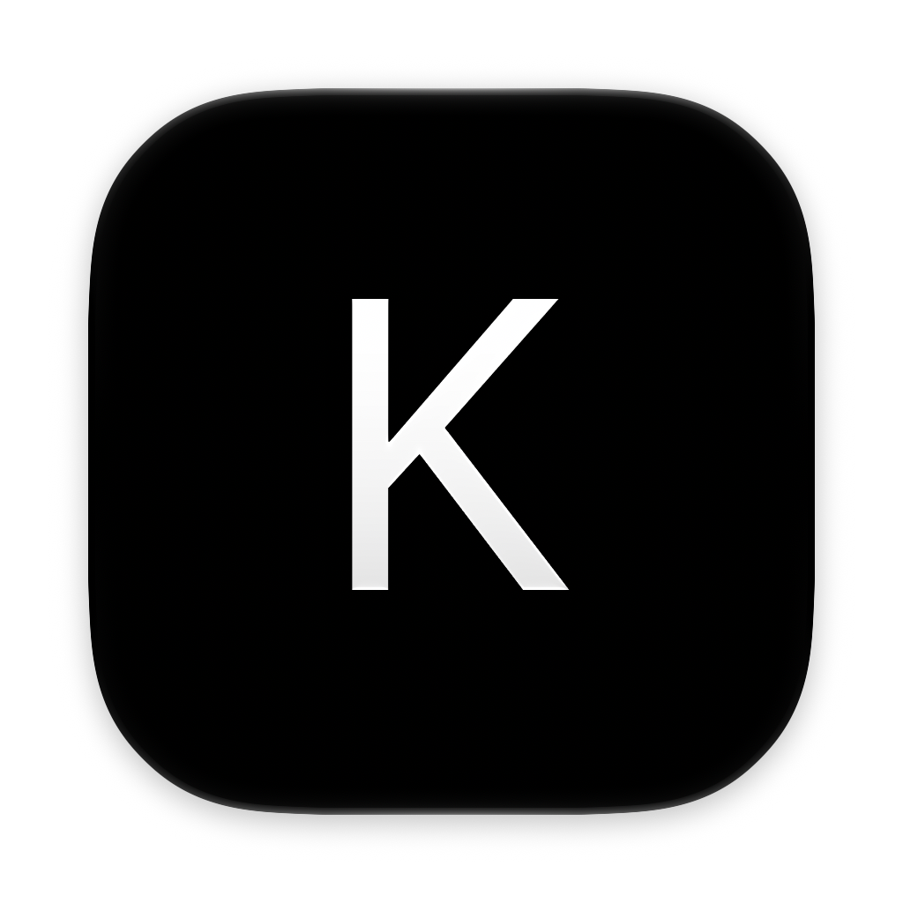
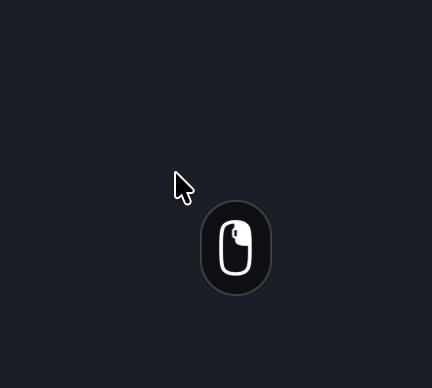

<h1 align="center">
  <a href="https://github.com/esphynox/Keyty">
    
     
    <strong>Keyty</strong>
  </a>
   
</h1>

   
   
   
   
   

Keyty is a free, open-source app that visualizes your keyboard and mouse actions in real time,
  making demos, presentations, tutorials, and livestreams easier to follow. It gives your audience a
  clear view of every shortcut, click, and input so you can communicate more effectively on screen.

## Features

### Keyboard

- Real-time display of keyboard shortcuts, special keys, and typed input
- Customizable overlay styles, themes, size, layout, and fade timing
- Filters for modified keystrokes, special keys, media keys, and mouse events

### Mouse

  
  

- Visualize mouse clicks and scroll actions alongside keyboard input
- Pointer highlight ring with configurable shape, color, size, and thickness
- Pointer icon overlay with adjustable position, size, background, and tint

## Installation

### Github

Download the latest release from [GitHub](https://github.com/esphynox/Keyty/releases)

### Build from Source

To build Keyty locally from source, see [BUILD.md](Docs/BUILD.md).

## Permissions

Keyty requires your permission to receive events from macOS in order to display your keystrokes and mouse clicks. See [PERMISSIONS.md](Docs/PERMISSIONS.md) for setup and troubleshooting.

## Privacy

Input events are processed locally on your Mac. Keyty does not record, store, or upload your keystrokes, typed text, mouse clicks, or pointer activity. See [PRIVACY.md](Docs/PRIVACY.md) for details, including Sparkle update checks.
